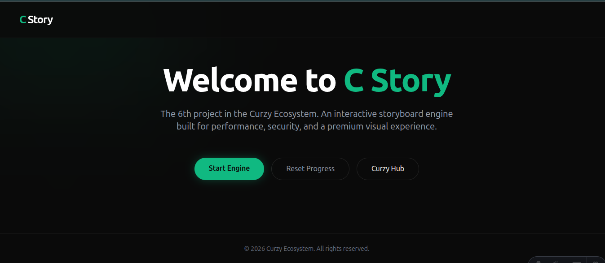
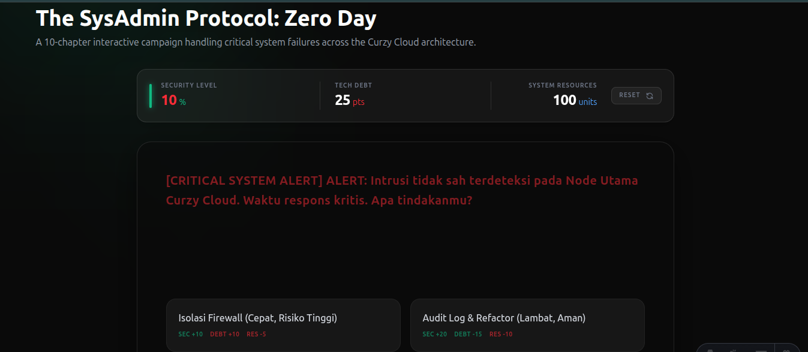
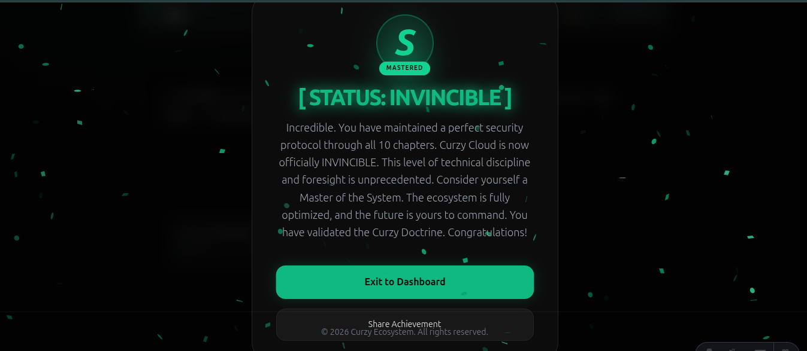

# C-Story 📖

> **Interactive Storyboard Engine | Curzy Ecosystem - Project #6**
> **Version: 2.0.0 (The Masterpiece Update)**

C-Story is a high-performance, interactive storytelling engine designed for immersive narrative experiences. Built with **Astro**, **TypeScript**, and **Tailwind CSS v4**, it follows the "Curzy Cloud" philosophy: Performance, Security, and Aesthetic Excellence.

---

## 🖼️ Preview & UI Showcase

| Dashboard | Story Engine | Victory (S-RANK) |
| :---: | :---: | :---: |
|  |  |  |

---

## 🚀 Core Features (v2.0.0)

- **10-Chapter Saga**: Experience the full "Curzy Cloud Saga" from Zero Day to The Masterpiece.
- **Session Persistence**: Progress is automatically saved to `localStorage`. Resume exactly where you left off.
- **Dynamic Tone System**: The UI reacts to your system's state. Low security triggers critical alerts and visual glitches.
- **Mastery Evaluation**: Reach the finale to receive a technical evaluation based on your security performance. Can you achieve the **S-RANK**?
- **Glassmorphic HUD**: A high-tech, semi-transparent Heads-Up Display tracking Security, Tech Debt, and Resources in real-time.

---

## 🛠️ Project Structure

```text
/ (Root)
├── src/
│   ├── components/      # Modular UI (StoryEngine, HUD, Modals)
│   ├── content/         # MDX-based narrative campaign
│   ├── data/            # Centralized Story Data (TypeScript)
│   ├── layouts/         # Glassmorphic Main Layout
│   └── pages/           # Application Routing
├── images/              # Project Previews & Documentation Assets
├── public/              # Static Assets & Icons
├── astro.config.mjs     # Framework Orchestration
└── tsconfig.json        # Strict TypeScript Configuration
```

---

## 💻 Getting Started

### Prerequisites

- **Node.js**: v18.0.0 or higher
- **NPM**: v9.0.0 or higher

### Installation

1. **Clone the Repository**:
   ```bash
   git clone https://github.com/Curzyori/C-Story-6.git
   cd C-Story-6
   ```

2. **Install Dependencies**:
   ```bash
   npm install
   ```

### Development

1. **Start Development Server**:
   ```bash
   npm run dev
   ```
   *The engine will be live at `http://localhost:4321`*

2. **Build for Production**:
   ```bash
   npm run build
   ```

---

## 📤 Deployment & Git Workflow

This project is optimized for deployment on Vercel, Netlify, or as a static site. To push your changes:

```bash
git add .
git commit -m "feat: upgrade to v2.0.0 with 10-chapter campaign and persistence"
git branch -M main
git push -u origin main
```

---

## 🎨 Design System

C-Story adheres to the **Curzy "Deep Dark"** aesthetic:
- **Core Background**: `#0a0a0a` (Deep Dark)
- **Primary Accent**: `#10b981` (Neon Green)
- **Warning State**: Red-shifting UI elements based on logic thresholds.
- **Typography**: Inter / System Sans-Serif (High Readability).

---

## 🔒 Security & Privacy

- **Safe Configuration**: `.gitignore` is set to "Fortress" standards, protecting all `.env`, `.db`, and system logs.
- **Zero-Data Leakage**: Local storage is used strictly for game session persistence.

---

## 📄 License

Licensed under the **MIT License**. Part of the Curzy Open Source Initiative.

**Built by [Curzyori](https://github.com/Curzyori)**
